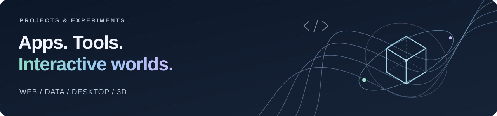

# Hey, I’m Seb.

**Exploring ideas through code, design, and a lot of experimentation.**

My personal projects take a few different directions: full-stack web apps, desktop tools, data workflows, and 3D portfolio experiments. Some are ready to explore, while others are prototypes or ideas I'm still developing.

[Portfolio](https://sebas-d-dev.github.io/portfolio-v2/) · [LinkedIn](https://www.linkedin.com/in/sebastian-torres-cs/) · [GitHub projects](https://github.com/Sebas-D-Dev?tab=repositories)

## Personal projects

### 3D Portfolio

*In progress · 3D engineering portfolio*

An interactive portfolio set inside an underground engineering facility. Hosted on ChatGPT Sites and still in development, 3D Portfolio explores a spatial way of presenting my work.

### Portfolio v2

*Ongoing personal portfolio · Web development*

My web portfolio for projects, experience, and technology interests, built with React, Next.js, and TypeScript. It brings together a project showcase, experience timeline, animated sections, and an RSS-based news reader.

[Visit the site](https://sebas-d-dev.github.io/portfolio-v2/) · [Explore the code](https://github.com/Sebas-D-Dev/portfolio-v2)

### Nexus

*Early prototype · Desktop tooling*

A customizable on-screen control-surface concept for organizing apps, shortcuts, and workflows. The work currently spans a landing-page concept and an Electron, React, and Vite application scaffold.

[Nexus Controls concept](https://github.com/Sebas-D-Dev/nexus-controls) · [Electron prototype](https://github.com/Sebas-D-Dev/nexus-electron-vite)

### Directory Structure Generator

*Prototype · Developer tools*

An experiment in planning and organizing project directory structures through workspaces. The prototype includes workspace and gallery APIs, plus a Gemini text-generation endpoint.

[Explore the code](https://github.com/Sebas-D-Dev/directory-structure-generator)

### Stack Inventory

*Inventory management · Full-stack development*

An inventory application covering products, vendors, purchasing, role-based views, and analytics. Built with Next.js, TypeScript, PostgreSQL, and Prisma, with an experimental Gemini-backed inventory assistant.

[Explore the code](https://github.com/Sebas-D-Dev/stack-inventory) · [Open the app](https://stack-inventory.vercel.app/) (sign-in required)

## Tools I use

- **Languages:** Python, JavaScript, TypeScript, SQL, HTML, and CSS
- **Web applications:** React, Next.js, Flask, Node.js, and Tailwind CSS
- **Data:** PostgreSQL, Prisma, and Supabase
- **Interfaces & experiments:** Framer Motion, Electron, Vite, and the Gemini API
- **Development & delivery:** Git, GitHub Actions, and GitHub Pages

## Experience alongside my projects

My professional experience includes Python and full-stack work on MrSureThing, UI/UX prototyping at Local Fiber, and IT and programming support at Florida Atlantic University.

More about my background is on my [portfolio](https://sebas-d-dev.github.io/portfolio-v2/) and [LinkedIn](https://www.linkedin.com/in/sebastian-torres-cs/).
